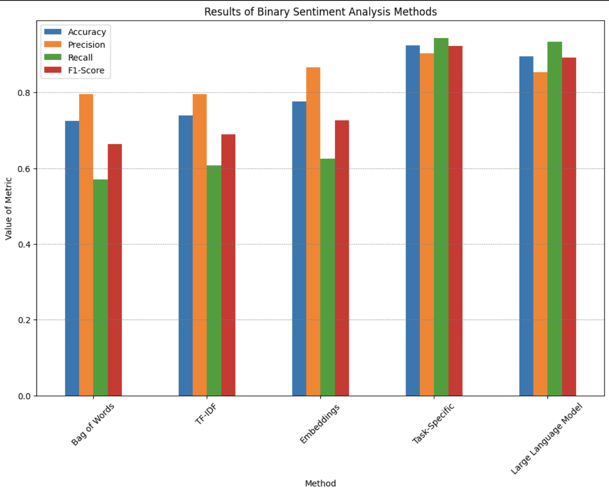
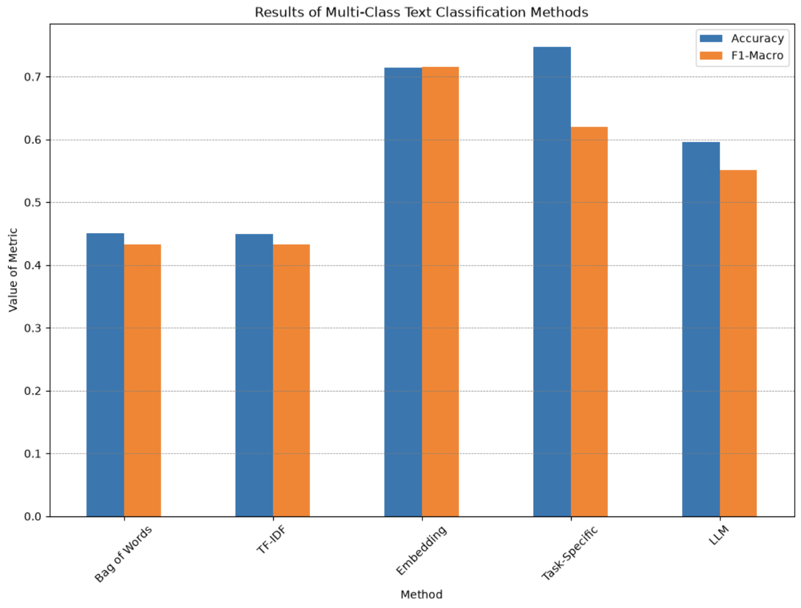

# Experimenting with Different Methods for Text Classification
This project contains a collection of experiments to measure the effectiveness of different methods of text classification. These methods will span from primitive NLP to newer generative methods of accomplishing the same tasks in order to understand their efficacy and efficiency. The reason for conducting these experiments is to see if more complex methods yield performance gains over simpler methods but to also understand the cost that improvement may come with in terms of total prediction time. The methods also include a test with general instructional language models to see if more general language models to see if low effort and supremely general strategies are competitive with narrow and specific systems. 

## The Setup of the Experiments
This work will be a basic test of a few different methods for completing text classification tasks in both a binary classification and multi-class classification setting. The methods will be as follows:
- Method 1: Feature Extraction using Bag-Of-Words
- Method 2: Feature Extraction using TF-IDF Vectorization
- Method 3: Using Text Embeddings as Features
- Method 4: Using a Pre-trained Task Specific Model
- Method 5: Using a Small General LLM

For methods 1-3 where we are only changing the way we extract text features and are responsible for a model, I used Logistic Regression and for the multi-class classification task I used Decision Tree models.

The outcomes to be considered will include: 
- The accuracy of predictions
- The time to train/acquire the model
- The time to predict on new test data

### The Data
I hoped to run these different methods on both binary and multi-class data to compare the results. The task for binary classification will be sentiment analysis of tweets and the task for multi-class classification will be topic classification of news articles. 

Our twitter data will come from the following 2 Kaggle Datasets: 
- [Main Twitter Sentiment Analysis Data](https://www.kaggle.com/datasets/jp797498e/twitter-entity-sentiment-analysis?resource=download)
- [Supplemental Twitter Sentiment Analysis Data](https://www.kaggle.com/datasets/yasserh/twitter-tweets-sentiment-dataset)

The data on news article topic classification comes from [this dataset on Kaggle.](https://www.kaggle.com/datasets/amananandrai/ag-news-classification-dataset?select=test.csv)

## Results 

From the results of our investigation regarding binary sentiment analysis data we see that the task specific model performs best by all metrics. This being said, the embedding model shows promise and with some tuning could be competitive with this. The general LLM method also has merit as noted by the result, but does take way more time predict on. 

The multi-class results show a similar trend to the binary model results. The task specific model in this case was not a perfect comparison because it was trained to predict many more classes. Despite this it still performed the best in terms of accuracy and this gives it possible merit to the idea of a task specific model that is trained specifically to predict the classes of our data. In the multi-class case, we see that the embedding feature collection method shows itself as a possible best option if it is tuned right and paired with a more appropriate model type.

## Potential Improvements
If this investigation were to be taken further, some actions that could teach us more about comparing methods could include: 
- *Trying different model types for the more basic feature extraction methods*: Basic feature collection methods may be all we need for particular NLP tasks, but it is possible more model complexity can maximize the efficacy of using these simple feature collection methods.
- *Fine tuning feature extraction methods such as embedding feature collections and TF-IDF*: Taking more control over the parameters of our feature collection could greatly impact our ability to inform any model
- *Using larger general LLMs*: For our general approach of predicting with a non-specified LLM, using larger and more powerful LLMs via API calls or with more powerful hardware could greatly improve the model's prediction ability. 
- *Expanding further on the number of classes we try to predict between in multi-class classification*: We could take these principles into other text prediction situations. Seeing how these methods perform when given more classes or different kinds of tasks could be useful in understanding their overall usefulness.